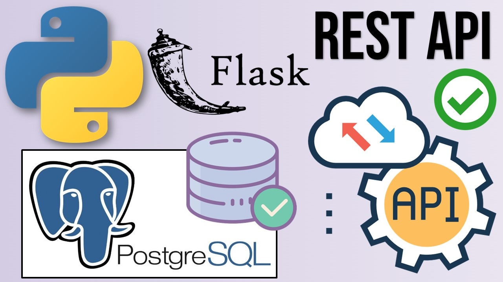
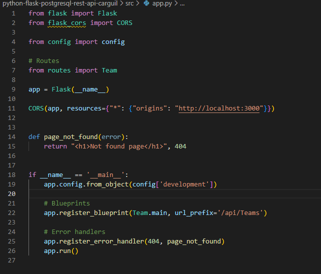

## 👨🏻‍💻 About Me:

 

- All about me is at **[My Website](https://jompy31.github.io/)**

- I’m currently working on `Machine learning with Python`

- I’m currently learning `React Native and machine learning`

## Description
Write a Rest Endpoint using Python Flask that takes a json with a team name and a role name and inserts this to a postgres database.
Example team name is DevOps and the role is DevOpsEngineer.
Write another endpoint that takes a team name and returns the roles. In this case if you send it DevOps it should return DevOpsEngineer

# REST API with Python, Flask and PostgreSQL

REST API with Python, Flask and PostgreSQL. I will use the HTTP protocol along with the GET, POST, PUT and DELETE methods and the JSON format to send and receive data; Also, learn how to test it using a REST client like Insomnia.

First, create a virtual environment:
### `python -m virtualenv env`

To install the necessary packages:
### `pip install -r requirements.txt`

Create an .env file:

### `SECRET_KEY=SECRET_KEY`
### `PGSQL_HOST=host`
### `PGSQL_USER=user`
### `PGSQL_PASSWORD=password`
### `PGSQL_DB=database`

Download PostgreSQL: https://www.postgresql.org/download/
 
Download Insomnia: https://insomnia.rest/download

  

  

## 🛠️ Technologies and Tools I use:

##  Let's get connected:

  

  

